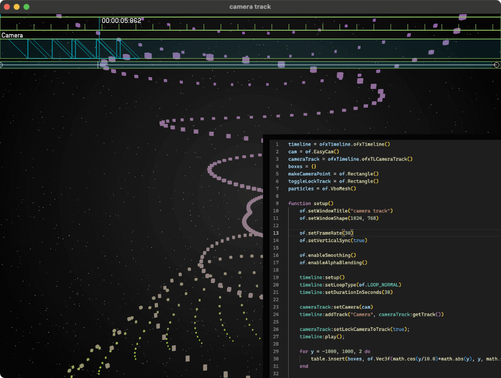

## loaf_timeline

This is a fork of [loaf](https://github.com/danomatika/loaf), make easy use of [ofxTimeline](https://github.com/funatsufumiya/ofxTimeline) with handy lua scripting environment.



## Usage

- use prebuilt binary from [release](https://github.com/funatsufumiya/loaf_timeline/releases)
- or build from source (now working on oF v0.12.0)
  - please download submodules: `git submodule update --init --recursive` or `git clone --recursive`
  - apply `projectGenerator` before build
 
and run:

```bash
$ loaf_timeline examples/timeline/camera_track/camera_track.lua

# NOTE: if mac, loaf_timeline is located on .app/Contents/MacOS
```

( Please copy [`copy_to_data_GUI`](https://github.com/funatsufumiya/ofxTimeline/tree/master/copy_to_data_GUI) content into `GUI` folder created next to the lua script if running examples. )

## Build

- if you change bindings, edit `swig` files and run `./scripts/generate_syntax.sh && ./scripts/generate_bindings.sh && make ReleaseLoaf` to compile.
  - if you add new module, be sure to change other scripts. Please check [this commit](https://github.com/funatsufumiya/loaf_timeline/commit/0f62f77d29633aa2945d636cb6ff7a79ee4aaa5c) where to change. (note: xxxBindings.cpp is auto-generated by swig)

## Example

see [examples/timeline](examples/timeline)

- Please make sure to copy [`copy_to_data_GUI`](https://github.com/funatsufumiya/ofxTimeline/tree/master/copy_to_data_GUI) content into `GUI` folder created next to the lua script. 

## License

Original Loaf is licensed under GPL v3.0 (see [Original README](./README_ORIG.md)). Original content of example/timeline is licensed under Apache License 2.0. (Copyright 2011-2014 [James George](http://www.jamesgeorge.org) co-developed by [YCAM InterLab](http://interlab.ycam.jp/))

-----
-----
Original README: [README_ORIG.md](./README_ORIG.md)